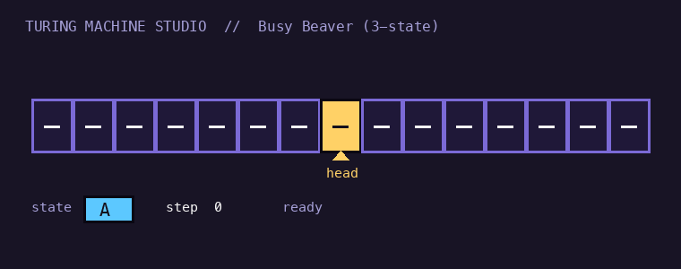

# Turing Machine Studio 🎞️

An interactive **Turing machine** simulator — watch the tape, head, and state animate as a machine
runs, load famous machines, or write your own transition table.



> **Live demo:** https://chicoryman.com/turing-machine-studio/

## Features
- **Animated tape** with a moving head and live state, step counter, and halt status.
- **Run / Step / Reset** with an adjustable speed slider.
- **Gallery** of classic machines:
  - Binary increment (`1011 → 1100`)
  - Palindrome checker over `{a,b}`
  - Unary addition (`1ᵃ 0 1ᵇ → 1ᵃ⁺ᵇ`)
  - **Busy Beaver (3-state)** — writes 6 ones, halts in 14 steps
  - **Busy Beaver (4-state)** — writes 13 ones, halts in 107 steps
- **Write your own machine**: edit the transition table live
  (`state read -> newState write move`, move ∈ `L`/`R`/`S`, `_` is blank).

## Run it
A single self-contained `index.html` — no build step, no dependencies.
```bash
open index.html          # macOS
# or: python3 -m http.server  → http://localhost:8000
```

## Host it (free)
Push this repo, enable GitHub Pages (deploy from `main` / root), and it's live at
`https://<you>.github.io/turing-machine-studio/`. Or drop `index.html` into any static host's
`public/turing-machine-studio/` folder.

## License
MIT © you
